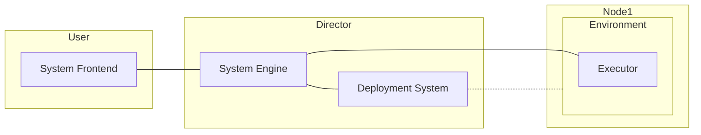

# General design
This document contains a general design of the system. Also take a look at the [vocabulary](vocabulary.md).

The [user story](userstory.md) describes user's view on the system. From the user story [requirements](requirements.md) and this architecture are created.

## Workflow
1. User defines a DAG of tasks
    - Each task consists of installation part and execution part
2. The DAG defines an environment where it should be executed. 
	- The system creates an environment definition (instructions how to create the environment) using combined installation instructions from each task and pushes it to corresponding nodes
3. User asks to start the experiment. The system transfer this command to corresponding nodes. Each node spins up environment and executors.
4. Each executor starts executing the DAG
5. After executor finishes all the tasks (or fails), it reports results to the system
6. After results received, the system finalizes the corresponding environment

## Assumptions
- Infrastructure has resources (servers/VMs/etc) to host the system ([vocabulary](vocabulary.md): Director infrastructure)
- Part of director infrastructure is available to users of the system
- Part of director infrastructure is available to target infrastructure (using IP address and/or DNS resolution)
- All target infrastructure devices are capable of executing arbitrary Python code (to support arbitrary pipelines)
	- Target infrastructure devices that are note capable can use [sidecar pattern](https://docs.microsoft.com/en-us/azure/architecture/patterns/sidecar)
- Target infrastructure is controlled by director infrastructre via IT automation software (Ansible, SaltStack, etc.)

## Coarse architecture of the system

As this system is designed to work close to target infrastructure and with many users, most often it would be constantly online and deployed on server-based machine. At the same time, users need to be able to design experiments and tasks even without connection to installation, and easily migrate experiments between installations, therefore a separate user-side module (*frontend*) is required.

As target network infrastructure could be different for different locations, and also usually already controlled by some IT automation software (like Ansible), the system will work via existing deployment systems to deploy user's code. This would allow to not to give direct node access to the system, but leave it to infrastructure administrators only.

As pipelines/DAGs do consists of several steps, these steps execution order should be controlled. It can be done on central server, but that wouldn't work well with bad Internet connection and establish certain requirements to deployment system (like fast transfer of results, etc.). Therefore, the system would use separate 'executors' deployed on nodes to control pipeline execution. In addition, these executors will provide additional capabilities that original deployment system is not able to (like event-exchange system).

Therefore, the system consists of 3 different parts:
- User-side Frontend
- System Engine
- Executor

### User-side Frontend
Frontend is a separate module that’s located on a user side. It's a single point of interaction with the system for user.
Frontend:
- contains building blocks for tasks/DAGs
- connects to System Engine to provide information about available infrastructure
- allows user to interact with system (prepare, start, and cancel experiments, receive status, etc.)
- allows user to attach additional infrastructures to the system
See [Frontend README](frontend/README.md) for further information.

### System Engine
The engine is deployed on *system installation location (director).* Usually it would be servers of infrastructure owner (e.g., university, research lab, company) that's relatively close to infrastructure used for experiments (to reduce latency, ensure proper bandwidth, etc.).

The local infrastructure would be controlled by *deployment system*, controlled by administrators. It would be accessible by system engine via a connector.

System Engine is always available by Executors via network.

Engine:
- interacts with *deployment system* to obtain information about local infrastructure and issue commands (to deploy experiments)
- prepares environment for user's experiments
- maintains currently running experiments
- provides event system for the experiments
- controls preprocessors for experiments

See [README](director/README.md) for additional information.

### Executor
Executor works on a node inside some *environment* (usually generated by the engine). It receives a DAG and executes it, reports results, sends and receives events. Executor's lifetime is bounded by the Environment.

See [README](executor/README.md) for additional information.
