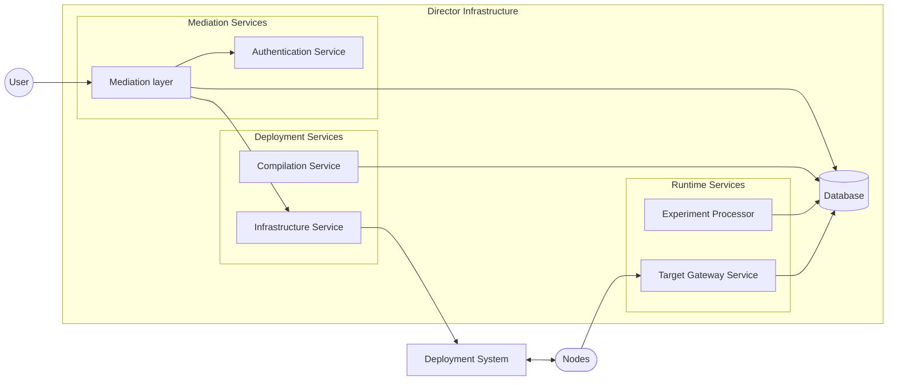

# Director infrastructure design
This document describes overall acrhitecture of director part of the system.

## Architecture
Core infrastructure is a service-oriented architecture that implements services to satisfy all [requirements](requirements.md). Communication between services could be either synchronous or asynchronous.

Core services are separated to three main service groups:
- **Mediation services.** These services support user interaction with the system, including authentication and communication with other parts of the system.
- **Deployment Services.** These services support experiment preparation and deployment process, such as pipeline preparation, environment compilation, environment distribution and start.
- **Runtime Services.** These services support running Experiments, such as providing event processing, results collection, and Experiment status monitoring.

### Database
This service represents RDBMS available to other core services as a persistent data storage. This service is not part of the system and currently implemented using PostgreSQL RDBMS.

### Deployment System
Many physical infrastructure deployments (especially with big amount of devices) are controlled by specialized IT automation software that provides connectivity to these nodes and basic command execution capabilities. Examples of such software are Ansible, Chef, SaltStack for physical deployments, and cloud-control APIs such as AWS or Azure.

In order to remove capabilities duplication, decrease development cost, avoid unneeded security consequences (such as privileged access to target nodes), and support different infrastructures, netunicorn assumes that one of these systems already installed and deployed on target infrastructure. 

Core services would interact with this system via a system-specific connector. These interactions include Environment distribution and startup, cleanup after execution, and other related tasks.

### Mediation Services
These services are responsible for interaction with users and processing their direct requests, and mediation of communication with other services. Specifically, mediation layer orchestrates experiment preparation and execution start using Deployment Services and provides information about infrastructure and experiments to a user.

#### Mediation layer
This service represents a layer that directly interacts with user's requests (from Frontend) and coordinate request processing. See [service_mediation](service_mediator.md) for additional information.

#### Authentication Service
This service handles authorization and authentication of users. See [service_authentication](service_authentication.md) for additional information.

### Deployment Services

These services fully cover all Experiment preparation, including infrastructure presentation to the user, Environments preparation, Experiment preprocessing, deployment, start, etc. 

#### Infrastructure Service
This service works with the Deployment System to present target infrastructures to the user for nodes enumeration, experiment deployment and execution start. See [service_infrastructure](service_infrastructure.md) for additional information.

#### Compilation Service
This service receives an Experiment object and corresponding infrastructure information, and then creates Environments for the distribution and upload the to corresponding data storage. See [service_compilation](service_compilation.md) for additional information.

### Runtime Services
These services are responsible for supporting running experiments.

#### Gateway Service
This service provides interface to Executors for interaction with director services, including pipeline receiving, results report, events, etc. See [service_gateway](service_gateway.md) for additional information.

#### Experiment Processor
This service monitors the status of each executor (reported via the Gatewa Service) and update the corresponding Experiment status and results. See [service_processor](service_processor.md) for additional information.